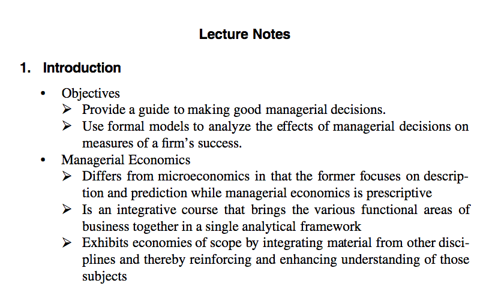

# Unblur-Scribd

A chrome extension/script to unblur blurred content on Scribd. Due to the way Scribd loads pages, extension needs to be run everytime you come across a blurred page. For a full explainiation [read this. ](http://iamkush.me/article/Viewing-blurred-content-on-Scribd-without-paying)

[Install the chrome extension from here ](http://bit.ly/unblurThePage)
[Install the firefox addon from here ](https://addons.mozilla.org/addon/unblur/)

## License

                        DO WHAT THE FUCK YOU WANT TO PUBLIC LICENSE
                                Version 2, December 2004

[WTFPL home page](http://www.wtfpl.net/)

Copyright (C) 2015 Kushagra Singh | kushagra14056@iiitd.ac.in

Everyone is permitted to copy and distribute verbatim or modified
copies of this license document, and changing it is allowed as long
as the name is changed.

## Before

## After

